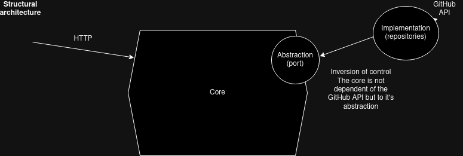
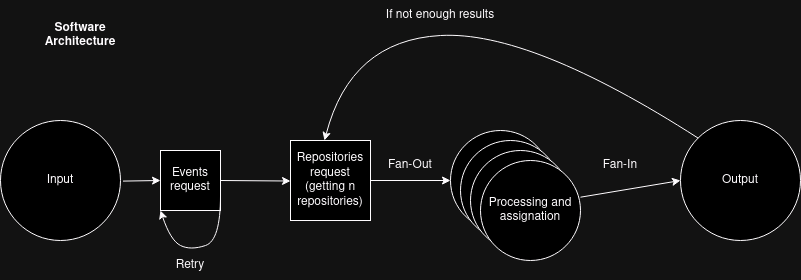
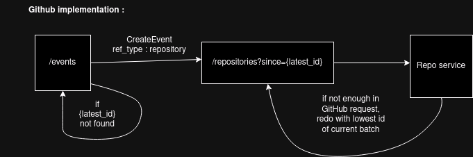

# Project Overview

This project adopts a hexagonal architecture to structure its components, providing a clear separation between different layers. The key advantage of this architecture lies in its ability to facilitate a clean division between the core logic and peripheral concerns. The inversion of control promotes loose coupling between abstractions and their implementations, enhancing maintainability and scalability.

## How to use
If you want to use the Makefile you will need to install [Wire](https://github.com/google/wire) and [Golangci-lint](https://github.com/golangci/golangci-lint)

and then run `make` and start the binary `./cmd/app/app`

or use Docker

`docker build -t image-name:tag .`

and run it

`docker run -p 5000:5000 image-name:tag`

## Dependencies

### Dependency Injection: Wire

[Wire](https://github.com/google/wire) is employed for dependency injection in this project. The choice is based on personal preference, and Wire enables the management of dependencies with ease.

### Router Framework: Gin

[Gin](https://github.com/gin-gonic/gin) is chosen as the router framework for its well-balanced characteristics. It offers low memory consumption, high speed, excellent scalability, and is built directly on top of the net/http package.

### HTTP Client: Fasthttp

[Fasthttp](https://github.com/valyala/fasthttp) is utilized as the HTTP client due to its superior performance. The library is known for its speed and efficiency in handling HTTP requests.

### JSON Serialization/Deserialization: Jsoniterator

[Jsoniterator](https://github.com/json-iterator/go-benchmark) is selected for its exceptional performance in handling JSON serialization and deserialization operations.

### Configuration Parsing: Viper

[Viper](https://github.com/spf13/viper) is employed for configuration parsing. This choice is made based on personal preference.

### Logging: Logrus

[Logrus](https://github.com/sirupsen/logrus) is chosen for logging purposes. The selection is based on personal preference.

### Testing: Testify

[Testify](https://github.com/stretchr/testify) is used for testing due to its simplicity in setting up test suites. This choice is made based on personal preference.

## License

This project is licensed under the [MIT License](LICENSE). Feel free to use and modify the code as needed.

